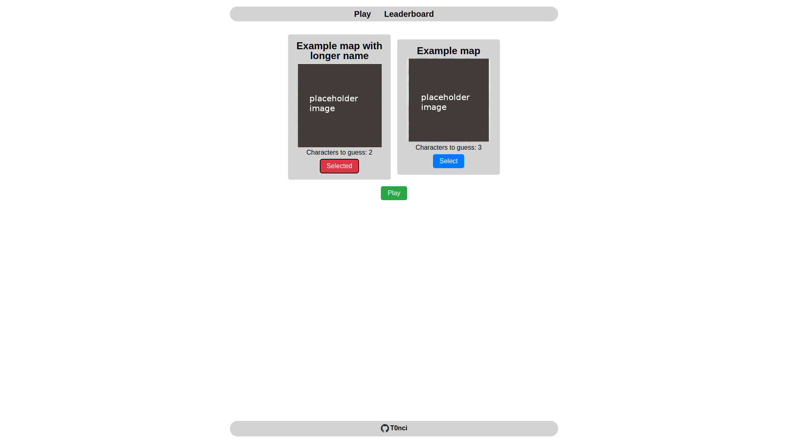
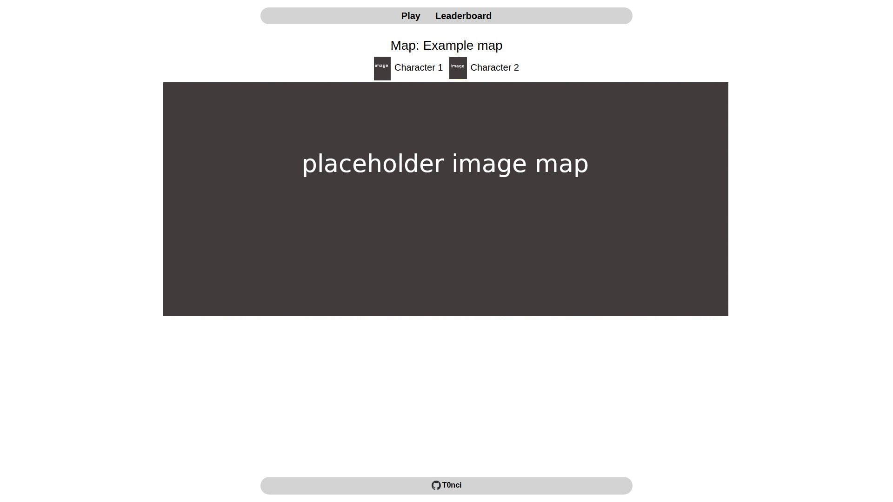
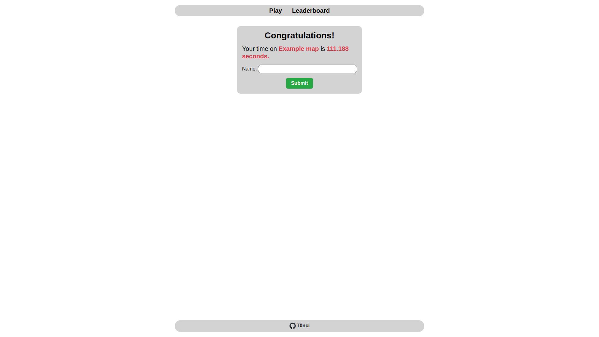
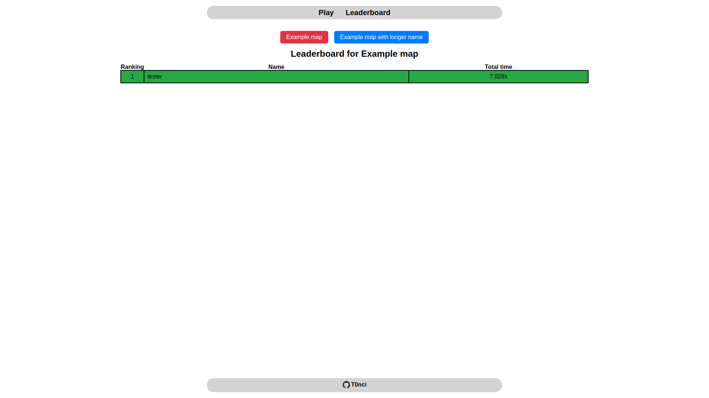

# Hidden in Plain Sight Front-End

This is the Front-End for the [Hidden in Plain Sight API](https://github.com/T0nci/odin-waldo-api).

## Live Preview

[Live Preview link](https://odin-waldo-frontend.vercel.app/)

## Demo

- Selecting maps 
- Playing a game 
- Seeing your score and entering a name 
- Accessing the leaderboard 

### Prerequisites

- Setup and run [Waldo API](https://github.com/T0nci/odin-waldo-api?tab=readme-ov-file#installation)

### Setup and running locally

1. Clone the repo:
   ```bash
   git clone git@github.com:T0nci/odin-waldo-frontend.git
   ```
   The above example is cloning through SSH, this can be done through HTTPS as well:
   ```bash
   git clone https://github.com/T0nci/odin-waldo-frontend.git
   ```
2. Install NPM packages:
   ```bash
   npm install
   ```
3. Create `.env` file and set the following environment variables with values that follow the instructions:
   ```dotenv
   VITE_API_URL='THE URL ON WHICH THE WALDO API IS RUNNING'
   ```
4. Start the server:
   ```bash
   npm run dev
   ```

And your server should have started. Visit your server by running the following command in the same terminal as the 4th step and then pressing enter.

```bash
o
```

## License

[MIT](LICENSE)

[(back to top)](#hidden-in-plain-sight-front-end)
